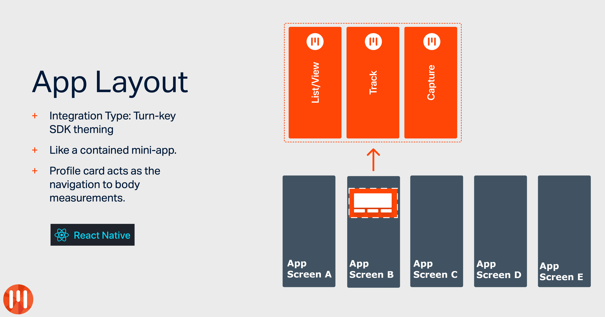

# MyFiziq Turnkey : React Native



MyFiziq Turnkey is intended to be a base template that can be forked and customised according to the integration planned. This saves developers the need to implement boilerplate integration code for adding MyFiziq technology to an existing app.

## Installation

### React Native

This guide assumes the React Native is installed and configured.

1. Install the MyFiziq plugin.
```sh
npm install https://github.com/MyFiziqApp/react-native-myfiziq-turnkey.git
npm install
```
1. Link the plugin to the project (this downloads and links in external libraries):
```sh
react-native link react-native-myfiziq-turnkey
```
2. Update the MyFiziq setup paramters with the environment key, secret, and environment strings (as recieved from MyFiziq). See:
```js
let result = await MYQTurnkey.setup(
        "REPLACE ME WITH KEY", 
        "REPLACE ME WITH SECRET", 
        "REPLACE ME WITH ENVIRONMENT");
```
3. Test that the project builds and runs, for example: iOS:
```sh
npx react-native run-ios
```
4. **For iOS:** Update the project's `Info.plist` with an appropriate `NSCameraUsageDescription` string for camera permissions. For example, see: https://useyourloaf.com/blog/privacy-settings-in-ios-10/

### Customisation Configuration

The MyFiziq Turnkey React Natice solution is simply a wrapper of the native MyFiziq Turnkey solution. You can fully customise the solution by forking both this wrapper and the native solution to modify as needed.

## Getting Started

1. Be sure to add the Profile Card component (the turnkey gateway) into the partner app.
2. Add the MyFiziq Turnkey initialisation to App start-up and link the user authentication/authorisation accordingly.

### Example App

Please refer to the example project (in `https://github.com/MyFiziqApp/react-native-myfiziq-turnkey-example`) on an example integration.

To run the Example App project, clone the repo and run pod install from the Example directory:

```ruby
git clone https://github.com/MyFiziqApp/react-native-myfiziq-turnkey-example.git --recusive
cd react-native-myfiziq-turnkey-example
npm install
npx react-native start; npx react-native run-ios
```

## Author

MyFiziq iOS Dev, dev@myfiziq.com

## License

MyFiziqSDK is Copyright 2016-2020.

